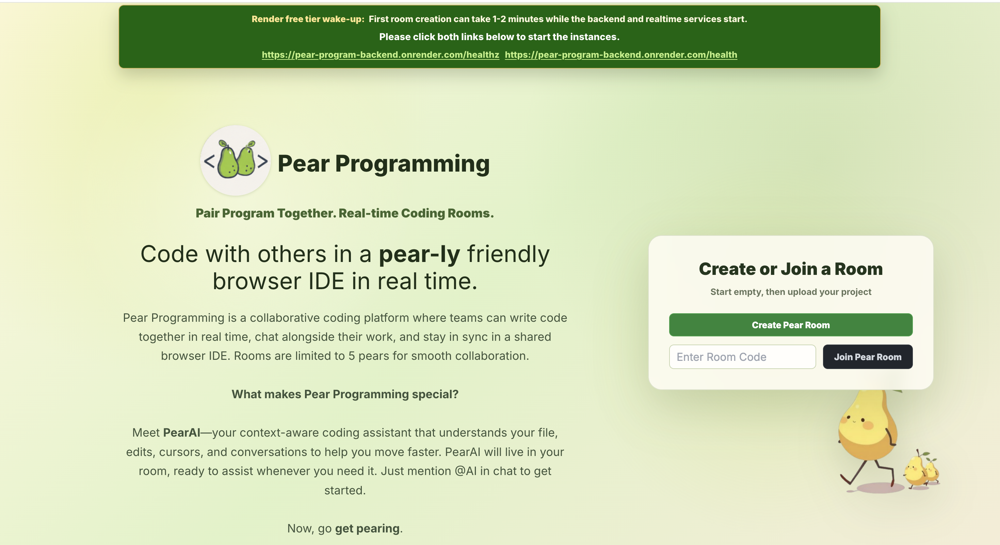
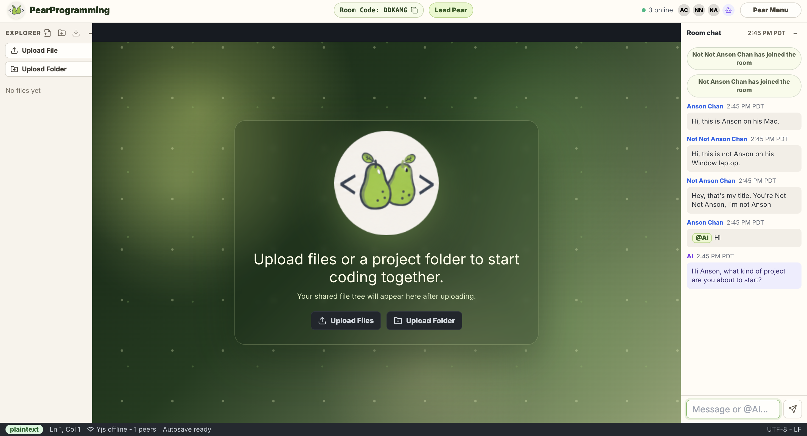
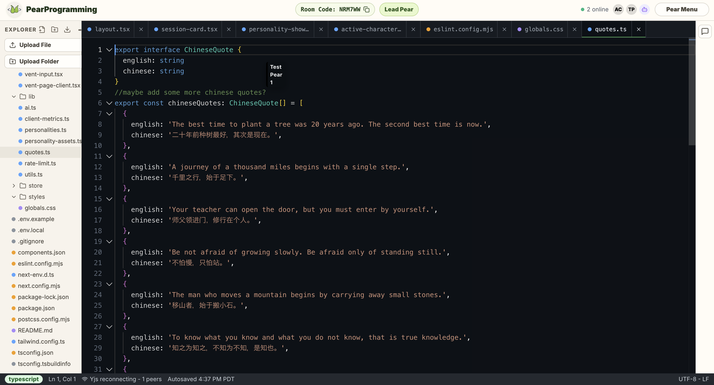

# Pear Programming

Pear Programming is a browser-based collaborative code editor with sandboxed code execution. It uses a split real-time architecture:

- Spring Boot owns server-issued guest sessions, PostgreSQL-backed users/workspaces/rooms/files, chat, cursors, presence, room permissions, AI proxying, cleanup, and metrics.
- A separate Node `y-websocket` service owns Yjs CRDT document synchronization and optional Redis-backed update persistence.
- React, Monaco, Yjs, SockJS/STOMP, and Tailwind power the browser app.
- Spring submits untrusted source to a configured Judge0 service; the browser never contacts Judge0 directly.

## Preview 

<p align="center">
  
  <br>
Pear Programming home page</em>
</p>
<br>
<p align="center">
  
  <br>
  Supports multiple users in the same room and context-aware AI agent.
</em>
</p>
<br>
<p align="center">
  
  <br>
  Type in real time and see what other users write (like Google Docs).
</em>
</p>

## Repository Layout

```text
backend/   Spring Boot API, WebSocket/STOMP, Redis-backed room presence, metrics
realtime/  Node y-websocket service with optional Redis persistence and snapshot flushing
frontend/  Vite + React + TypeScript + Monaco collaborative editor UI
```

## Local Prerequisites

- Java 21
- Maven 3.9+
- Node 20+
- npm 10+
- Docker Desktop for the default local PostgreSQL and Redis setup

## Quick Start

Start PostgreSQL and Redis, then run the three application services. PostgreSQL is required; Redis remains an ephemeral collaboration accelerator and can fall back to process-local presence during development. PearAI returns a configuration error until `GROQ_API_KEY` is set, unless `PEARPROGRAM_AI_PLACEHOLDER=true` is enabled for local demos:

```powershell
docker compose up -d postgres redis

cd backend
mvn spring-boot:run

cd ../realtime
npm install
npm run dev

cd ../frontend
npm install
npm run dev
```

The editor can be used without Judge0, but Run requests will finish with a provider-unavailable message. To enable execution, configure either a self-hosted Judge0 deployment:

```env
JUDGE0_BASE_URL=http://localhost:2358
```

or a hosted RapidAPI-compatible Judge0 endpoint:

```env
JUDGE0_BASE_URL=https://your-judge0-compatible-host
JUDGE0_API_KEY=your-private-key
JUDGE0_API_HOST=your-provider-host
```

These variables belong only on the Spring backend. Never add them to `VITE_*` variables. A full self-hosted Judge0 deployment includes its own workers, database, and queue; deploy it using the Judge0 project’s supported setup rather than adding it to this lightweight Compose file.

The realtime service loads `realtime/.env` automatically when it starts. It uses `ioredis`, so Upstash must be configured with the TCP URL:

```env
REDIS_URL=rediss://default:<upstash-token>@<upstash-host>:6379
REDIS_KEY_PREFIX=pearprogram
AUTH_VALIDATION_ENDPOINT=http://localhost:8081/internal/auth/realtime/validate
SNAPSHOT_ENDPOINT=http://localhost:8081/internal/files
ROOM_CLEANUP_ENDPOINT=http://localhost:8081/internal/rooms
ROOM_CLEANUP_GRACE_MS=120000
PORT=1235
```

Do not put `UPSTASH_REDIS_REST_URL` or `UPSTASH_REDIS_REST_TOKEN` into the realtime service unless the code is changed to use `@upstash/redis`. If no Redis TCP config is present, realtime starts with in-memory Yjs docs and logs that cross-instance persistence and live cross-instance Yjs fanout are unavailable.

Default local endpoints:

- Frontend: `http://localhost:5174`
- Spring API/STOMP: `http://localhost:8081`
- Node Yjs WebSocket: `ws://localhost:1235`

For two laptops on the same network, `localhost` only points to each laptop itself. Start backend and realtime bound normally, then set the second laptop's frontend env to the host machine's LAN IP:

```env
VITE_API_URL=http://YOUR_LAN_IP:8081
VITE_STOMP_URL=http://YOUR_LAN_IP:8081/ws
VITE_YJS_URL=ws://YOUR_LAN_IP:1235
```

If you are serving the Vite dev app from the host laptop too, start it with `npm run dev -- --host 0.0.0.0` so the second laptop can open it.

The backend room service is the source of truth for create/join. Room codes are normalized by trimming spaces, removing dashes, and uppercasing before lookup.

## Authentication and identity

The current sign-in flow creates a guest profile rather than a password account. Spring generates an unguessable user UUID, stores the authenticated principal in an HTTP-only `JSESSIONID` session, and restores that identity after refresh. Profile changes preserve the UUID; Sign Out invalidates both the session and the user's outstanding realtime tokens. Client-supplied user IDs are never an authorization input.

REST mutations use a cookie-backed CSRF token. SockJS/STOMP reuses the authenticated HTTP session, requires the same CSRF token when connecting, and authorizes every room send/subscription against active membership. The separate Yjs service cannot trust browser query parameters by themselves, so the frontend supplies a short-lived opaque token and Node validates both that token and room membership with Spring before accepting the WebSocket upgrade. Non-loopback calls to Spring's `/internal/**` service routes also require the same `INTERNAL_SERVICE_TOKEN` on backend and realtime; use a high-entropy deployment secret.

Authentication endpoints:

- `POST /api/auth/guest` creates a new guest session from a display name and optional avatar.
- `GET /api/auth/session` restores the current session and rotates the short-lived realtime token.
- `PATCH /api/auth/profile` updates the authenticated profile without changing identity.
- `POST /api/auth/logout` invalidates the session and realtime tokens.
- `GET /api/auth/csrf` supplies the CSRF header name and value used by the frontend.

Local cookie defaults are `AUTH_COOKIE_SECURE=false` and `AUTH_COOKIE_SAME_SITE=lax`. With HTTPS set `AUTH_COOKIE_SECURE=true`. If frontend and backend are on different sites, browsers require `AUTH_COOKIE_SAME_SITE=none` together with a secure cookie; a same-site reverse proxy is more reliable because some browsers block third-party cookies entirely. `AUTH_SESSION_TIMEOUT` defaults to `12h`, and `AUTH_REALTIME_TOKEN_TTL` defaults to `10m`.

Production Redis should use TCP, not REST. The backend accepts either `SPRING_REDIS_URL=rediss://default:<token>@<host>:6379` or `SPRING_REDIS_HOST`/`SPRING_REDIS_PORT`/`SPRING_REDIS_USERNAME`/`SPRING_REDIS_PASSWORD`/`SPRING_REDIS_SSL=true`. Use `SPRING_REDIS_TIMEOUT=10s` or higher on Render/Upstash if TLS connection initialization is slow. Keep `SPRING_REDIS_HEALTH_ENABLED=false` so Redis does not block Render health checks. Backend Redis room-state connectivity is checked after startup and retried with `PEARPROGRAM_REDIS_CONNECTION_RETRY_MS`, so Redis does not block port binding. Both backend room state and realtime Yjs persistence use `PEARPROGRAM_REDIS_KEY_PREFIX`/`REDIS_KEY_PREFIX` with the default prefix `pearprogram`. Keep `PEARPROGRAM_REALTIME_REDIS_BROADCAST_ENABLED=true` in production so room STOMP events are fanned out across backend instances; the listener starts after application startup and retries without blocking deploys.

For Render, use `/healthz` as a lightweight backend health endpoint. It returns immediately and does not check Redis or other external services.

## PostgreSQL persistence

Flyway runs automatically before Hibernate validation. The durable schema contains:

- `app_users` for server-issued guest identities and profiles.
- `workspaces` and `workspace_members` for ownership and access.
- `rooms` and `room_members` for room metadata and durable membership.
- `workspace_files` for file content, ordering, and unique workspace-relative paths.
- `file_snapshots` for the latest Yjs encoded state and plain-text recovery copy.
- `ai_annotations` for active/dismissed inline annotations.

Each room owns exactly one workspace. Joining the room adds both room and workspace membership. Redis no longer stores the durable room file tree; it remains responsible for active presence, lead/lock state, room-event fanout, and live Yjs updates. The Node realtime service periodically writes the latest Yjs snapshot through the authenticated internal API.

Backend database variables:

| Variable | Local default | Purpose |
| --- | --- | --- |
| `SPRING_DATASOURCE_URL` | `jdbc:postgresql://localhost:5432/pearprogram` | PostgreSQL JDBC URL |
| `SPRING_DATASOURCE_USERNAME` | `pearprogram` | Database user |
| `SPRING_DATASOURCE_PASSWORD` | `pearprogram` | Database password; use a secret in production |
| `SPRING_DATASOURCE_MAX_POOL_SIZE` | `10` | Maximum Hikari connections |
| `SPRING_DATASOURCE_MIN_IDLE` | `1` | Minimum idle connections |
| `SPRING_DATASOURCE_CONNECTION_TIMEOUT_MS` | `10000` | Connection acquisition timeout |

The previous prototype stored all users, workspaces, rooms, files, and snapshots in memory, so there is no durable pre-Phase-2 dataset to migrate. Existing browser session snapshots may reference obsolete workspace IDs and should be cleared once if they cannot reopen; no PostgreSQL rows are silently synthesized from client state.

To inspect migration status or rerun startup against an existing database:

```bash
docker compose up -d postgres
cd backend
mvn spring-boot:run
```

Restarting the backend validates the existing Flyway history and Hibernate mappings without recreating data. Never edit an applied migration; add a new versioned migration instead.

## Architecture Notes

Yjs document edits flow only through the Node service. Spring handles STOMP events for chat, cursors, permissions, file-tree sync events, and presence. PostgreSQL is the durable source of truth. Redis stores ephemeral room/presence state with 24h TTL when configured and fans out Spring room events and Yjs updates across service instances; otherwise the backend logs its process-local collaboration fallback.

When the last user leaves a room, Spring schedules ephemeral presence cleanup after `ROOM_CLEANUP_GRACE_SECONDS` seconds. The realtime service also waits after the last Yjs websocket closes, flushes snapshots when `SNAPSHOT_ENDPOINT` is configured, removes in-memory Yjs docs for that room, and asks Spring to clean up only if no members reconnected. Durable room/workspace/file rows remain available for reconnection; only an explicit room-close action cascades their deletion.

## Sandboxed Code Execution

The Run toolbar captures the current Monaco model, which is the model bound to the active Yjs collaborative document. The user chooses one of the allowlisted languages, can supply standard input, and sees status, stdout, stderr, compiler output, runtime errors, exit code, and duration in the integrated console.

```text
Monaco/Yjs editor
  -> Spring room execution API
  -> execution service and policy checks
  -> Judge0 provider adapter
  -> isolated Judge0 worker
  -> normalized execution result
  -> requester-only API polling
  -> integrated console
```

Execution results use requester-only HTTP polling instead of the existing room STOMP topics. Pear Programming’s current STOMP broker has shared room topics and no authenticated user destinations, so room broadcast would reveal private stdin/output to collaborators. Execution IDs and a frontend run sequence prevent an older result from replacing a newer run.

### API

Submit an execution:

```http
POST /api/rooms/{code}/executions
Cookie: JSESSIONID=<server-issued session>
X-XSRF-TOKEN: <token returned by /api/auth/csrf>
Idempotency-Key: <unique value for this Run click>
Content-Type: application/json

{
  "language": "python",
  "sourceCode": "print('hello')",
  "stdin": ""
}
```

The API responds with HTTP `202` and an execution ID in `QUEUED` or `SUBMITTED` state. Retrieve it with:

```http
GET /api/rooms/{code}/executions/{executionId}
Cookie: JSESSIONID=<server-issued session>
```

States are `QUEUED`, `SUBMITTED`, `RUNNING`, `COMPLETED`, `COMPILATION_ERROR`, `RUNTIME_ERROR`, `TIMED_OUT`, and `FAILED`. A terminal execution never transitions back to a running state.

### Supported languages

Judge0 IDs are centralized in `ExecutionLanguageRegistry`; clients submit language names, never provider IDs.

- Java (`Main` class required)
- Python
- JavaScript / Node.js
- C
- C++

### Backend environment variables

| Variable | Default | Purpose |
| --- | --- | --- |
| `JUDGE0_BASE_URL` | `http://localhost:2358` | Self-hosted or compatible provider base URL |
| `JUDGE0_API_KEY` | empty | Hosted provider key, sent as `X-RapidAPI-Key` |
| `JUDGE0_API_HOST` | empty | Hosted provider host, sent as `X-RapidAPI-Host` |
| `JUDGE0_REQUEST_TIMEOUT` | `5s` | Connect/read timeout per provider request |
| `JUDGE0_EXECUTION_TIMEOUT_SECONDS` | `5` | Judge0 CPU-time limit |
| `JUDGE0_EXECUTION_DEADLINE` | `20s` | End-to-end backend deadline |
| `JUDGE0_POLL_INTERVAL` | `750ms` | Provider polling interval |
| `JUDGE0_MAX_POLL_ATTEMPTS` | `25` | Hard polling bound |
| `JUDGE0_MAX_RETRIES` | `2` | Retries for HTTP 429, 5xx, and transport errors |
| `JUDGE0_RETRY_BACKOFF` | `200ms` | Initial bounded exponential backoff |
| `EXECUTION_MAX_SOURCE_BYTES` | `100000` | UTF-8 source limit |
| `EXECUTION_MAX_STDIN_BYTES` | `20000` | UTF-8 stdin limit |
| `EXECUTION_RATE_LIMIT_PER_MINUTE` | `10` | Per-user, per-room submission limit |
| `EXECUTION_RECORD_TTL` | `15m` | Result/idempotency retention |
| `EXECUTION_WORKER_THREADS` | `4` | Bounded local polling worker count |

### Security model and limitations

- User code never executes in Spring, Node, the frontend, or the Pear Programming containers. Judge0 is the isolation boundary and must be independently secured, patched, resource-limited, and kept off unrestricted internal networks.
- The server enforces language, source/stdin size, deadline, polling, retry, queue, rate, membership, ownership, and idempotency checks. Stored execution records do not contain source or stdin and expire automatically.
- Provider credentials and raw provider failures never enter frontend contracts or room events. Console output is rendered as React text, not HTML.
- Identity is server-issued and consistent across REST, STOMP/SockJS, and Yjs. This phase deliberately implements guest sessions, not password accounts or OAuth; anyone can create a new guest, and there is not yet account recovery, email verification, durable account storage, or an invitation model.
- HTTP sessions and opaque Yjs access tokens are process-local. Multi-instance backend deployment therefore requires sticky sessions until Phase 2/4 moves session/token state to a shared store or replaces the token with an appropriately signed credential.
- When `INTERNAL_SERVICE_TOKEN` is blank, `/internal/**` accepts only direct loopback traffic for convenient local development. Container or hosted deployments must configure the same secret on Spring and Node; do not expose internal routes directly at an ingress.
- Execution records and rate windows are process-local. This matches the current single-backend development/deployment model. A multi-instance deployment should move execution metadata/idempotency/rate state to Redis or a database and use a shared job queue.
- Judge0 language IDs can differ across customized deployments. The included mapping targets standard Judge0 CE IDs for the five supported languages; update the centralized registry if the provider’s language catalog differs.

### Testing execution

Automated backend tests mock the execution provider and do not require a real Judge0 service:

```bash
cd backend
mvn test
```

Frontend and realtime checks:

```bash
cd frontend
npm run lint
npm run build

cd ../realtime
npm run lint
```

The frontend currently has no JavaScript test runner; TypeScript checking and the production Vite build are the repository’s existing frontend verification conventions. Persistence integration tests use H2 in PostgreSQL compatibility mode so automated tests do not require public infrastructure; final local verification also applies Flyway to the Compose PostgreSQL service.

## Current Room UX

- The root page lets users create an empty room or join by room code.
- Rooms start empty. Users add code through New File, New Folder, Upload Files, or Upload Folder.
- Local uploads are the primary project-loading path. GitHub import scaffolding still exists in the backend, but it is not the primary UI flow.
- Folder uploads populate the explorer tree without opening every file as a tab. Files open on demand when clicked.
- The explorer download button exports a ZIP with relative paths preserved.
- Monaco language highlighting is inferred from file extensions for JavaScript, TypeScript, Python, Java, C, C++, HTML, CSS, JSON, Markdown, SQL, and plaintext fallback.
- Editor changes autosave through the browser to Spring and continue to sync through the existing Yjs realtime path.
- If a populated multi-user room switches to another uploaded folder, participants must approve the switch through the room project-switch WebSocket event before files are replaced.
