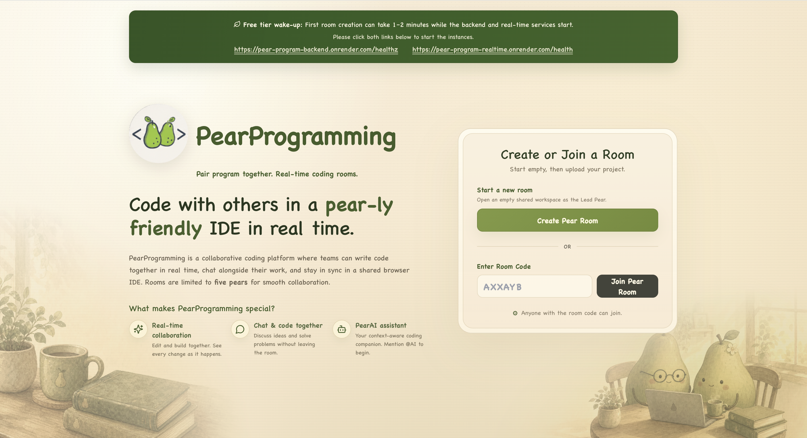
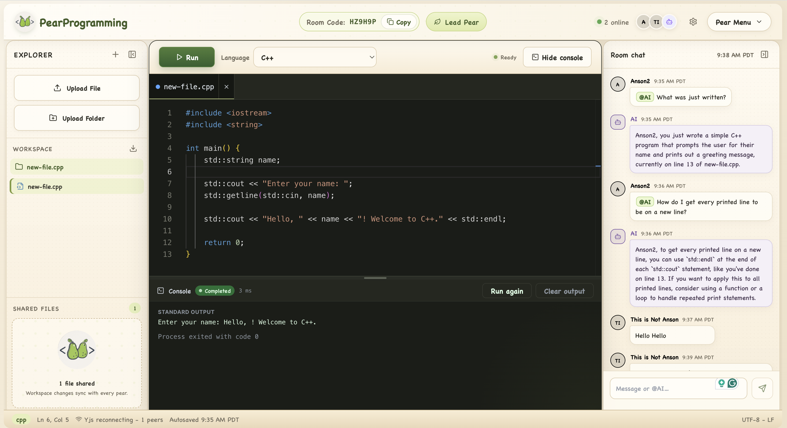

# Pear Programming

Pear Programming is a real-time collaborative browser IDE for pair programming. Users can create or join a room, edit shared files, chat, work with PearAI, and run code in a sandboxed environment.

## Highlights

- Real-time Monaco editing powered by Yjs
- Shared workspaces, file uploads, folders, tabs, and collaborative deletion
- Room presence, chat, lead controls, locking, and reconnect-safe cleanup
- Sandboxed Judge0 execution and optional context-aware PearAI assistance
- Durable workspaces and files stored in PostgreSQL

## Preview

<p align="center">
  
  <br>
  <em>Create or join a collaborative coding room.</em>
</p>

<p align="center">
  
  <br>
  <em>Edit, run, and discuss code together in real time.</em>
</p>

## Architecture

```text
React + Monaco
  ├─ REST and STOMP ──> Spring Boot ──> PostgreSQL
  │                         ├─────────> Redis
  │                         ├─────────> Judge0
  │                         └─────────> AI provider
  └─ Yjs WebSocket ──> Realtime service ──> Redis
```

- `frontend/` — React, TypeScript, Vite, Monaco, and the IDE interface
- `backend/` — Spring Boot API, authentication, rooms, chat, presence, files, and execution
- `realtime/` — Node Yjs synchronization and snapshot service
- `docs/` — deployment and reliability documentation

PostgreSQL is the durable source of truth. Redis coordinates ephemeral presence, realtime fanout, Yjs updates, and execution jobs.

## Requirements

- Java 21+
- Maven 3.9+
- Node.js 20+
- npm 10+
- Docker Desktop

## Run Locally

Start PostgreSQL and Redis:

```bash
docker compose up -d postgres redis
```

Create `frontend/.env.local`:

```env
VITE_API_URL=http://localhost:8081
VITE_STOMP_URL=http://localhost:8081/ws
VITE_YJS_URL=ws://localhost:1235
```

For Redis-backed realtime synchronization, create `realtime/.env`:

```env
REDIS_HOST=localhost
SNAPSHOT_ENDPOINT=http://localhost:8081/internal/files
ROOM_CLEANUP_ENDPOINT=http://localhost:8081/internal/rooms
```

Run each service in a separate terminal:

```bash
cd backend
mvn spring-boot:run
```

```bash
cd realtime
npm install
npm run dev
```

```bash
cd frontend
npm install
npm run dev
```

Open `http://localhost:5174`.

## Environment Variables

The complete reference is [.env.example](.env.example). Production values are documented in [.env.production.example](.env.production.example).

| Service | Essential variables |
| --- | --- |
| Frontend | `VITE_API_URL`, `VITE_STOMP_URL`, `VITE_YJS_URL` |
| Backend database | `SPRING_DATASOURCE_URL`, `SPRING_DATASOURCE_USERNAME`, `SPRING_DATASOURCE_PASSWORD` |
| Backend Redis | `SPRING_REDIS_HOST`, `SPRING_REDIS_PORT`, or `SPRING_REDIS_URL` |
| Execution | `JUDGE0_BASE_URL`; hosted providers may also require `JUDGE0_API_KEY` and `JUDGE0_API_HOST` |
| PearAI | `GROQ_API_KEY` |
| Realtime Redis | `REDIS_URL`, or `REDIS_HOST` and `REDIS_PORT` |
| Realtime API | `AUTH_VALIDATION_ENDPOINT`, `SNAPSHOT_ENDPOINT`, `ROOM_CLEANUP_ENDPOINT` |
| Internal security | `INTERNAL_SERVICE_TOKEN`, shared by backend and realtime in deployed environments |

Judge0 and PearAI are optional for local editing and collaboration. Their related features show a configuration or availability message when not configured.

## Supported Execution Languages

Java, Python, JavaScript, C, C++, TypeScript, SQL, C#, PHP, Ruby, Go, Rust, Kotlin, Swift, R, and Bash.

Judge0 language IDs vary between deployments. Compare the backend registry with the configured provider's `/languages` response.

## Testing

```bash
(cd frontend && npm run lint && npm test && npm run build)
(cd backend && mvn test)
(cd realtime && npm run lint && npm test)
```

Frontend and backend tests use mocked execution providers, so Judge0 is not required.

Execution latency definitions and repeatable benchmark commands are documented in
[docs/execution-performance.md](docs/execution-performance.md).

## Deployment

See [docs/deployment.md](docs/deployment.md) for the production Compose topology, HTTPS/WebSocket routing, secrets, migrations, backups, and recovery.
